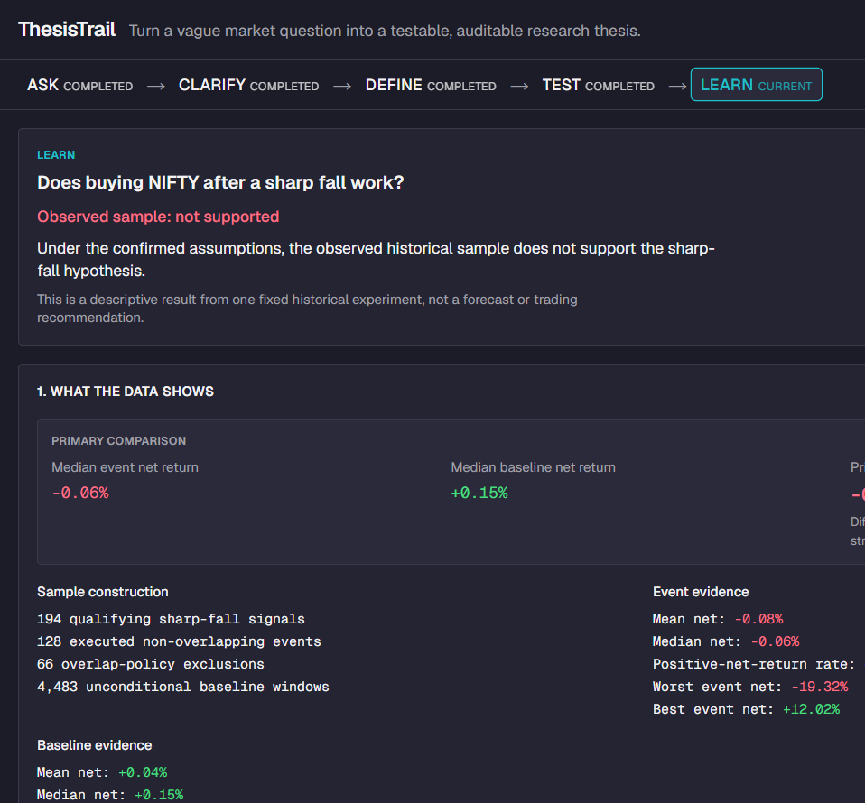
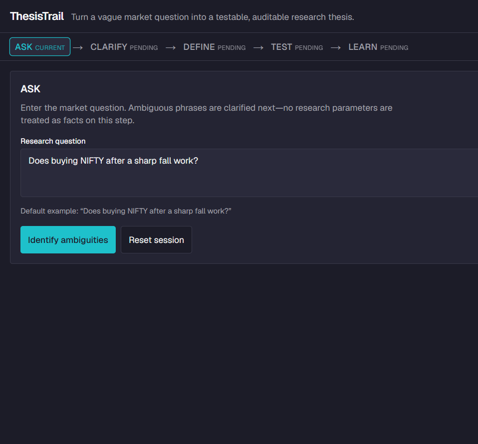
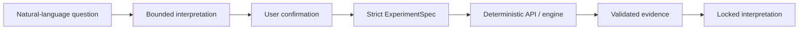

# ThesisTrail

Turn a vague market question into a testable, auditable research thesis.

ThesisTrail is a compact Next.js research prototype for an internship assessment. It walks a vague NIFTY question through **ASK → CLARIFY → DEFINE → TEST → LEARN**, keeps every material assumption visible in an Assumption and Evidence Trace, and runs a deterministic historical event study on a fixed bundled snapshot. Optional AI may help rephrase ambiguities; it never calculates metrics or writes the locked conclusion.

**Links**

- [Live application](https://thesistrail.vercel.app)
- [Thinking Note](docs/submission/THINKING_NOTE.pdf) (also [Markdown](docs/submission/THINKING_NOTE.md))
- [AI Usage Note](docs/submission/AI_USAGE_NOTE.pdf) (also [Markdown](docs/submission/AI_USAGE_NOTE.md))
- [Demo script](docs/submission/DEMO_SCRIPT.md)
- [Submission checklist](docs/submission/SUBMISSION_CHECKLIST.md)
- Repository: https://github.com/HarshYadav1711/ThesisTrail



## Why the apparently simple question is ambiguous

“Does buying NIFTY after a sharp fall work?” hides several decisions:

- **NIFTY** — index research series vs ETF vs futures (only a proxy is tradable)
- **buying** — timing, direction, size
- **sharp fall** — threshold definition and when it is known
- **work** — absolute profit, win rate, or comparison to a baseline

ThesisTrail forces those choices into explicit, confirmable assumptions before any numbers appear.

## ASK → CLARIFY → DEFINE → TEST → LEARN

1. **ASK** — enter the research question (example prefilled).
2. **CLARIFY** — four groups (instrument, sharp fall, execution window, evaluation). Unsupported options stay visible but block confirmation. Interpretation loading never blocks the cards.
3. **DEFINE** — review the locked experiment; run only on explicit action.
4. **TEST** — server executes the deterministic engine against the bundled CSV.
5. **LEARN** — evidence first, then locked interpretation, non-claims, and proposed next tests.



## Assumption and Evidence Trace

The Trace rail (stacked under main content on narrow viewports) shows provenance for material values: user stated, needs clarification, proposed assumptions, confirmed assumptions, derived evidence, and interpretation. Confirmed values are never silently invented by the UI.

## Locked experiment

| Parameter | Locked value |
|---|---|
| Series | NIFTY 50 index (research series; not directly tradable) |
| Signal | Close-to-close return ≤ −2.0%, observed after the close |
| Entry | Next trading session open |
| Exit | Close of the fifth session counting entry as session 1 |
| Cost | 10 bps illustrative round-trip |
| Primary outcome | Event median net − baseline median net |
| Effective period | 2007-09-17 through 2025-12-31 |

## What the data showed

On the fixed snapshot (**4,487** sessions):

- **194** qualifying signals · **128** executed events · **66** overlap exclusions · **4,483** baseline windows
- Event median net ≈ **−0.06%**
- Baseline median net ≈ **+0.15%**
- Primary delta ≈ **−0.21 percentage points** (`−0.002099981130827655`)
- Classification: **`not_supported`**

Dataset SHA-256:

`59da480d49e5628dc1d67aa5c200c41b49cfb3ad4bc2365bc5fb7ae2992736a4`

## What the result does not prove

It is not financial advice, not proof of future profitability, not a claim that the opposite strategy works, not a formal significance test, and not an endorsement of trading the index directly. Costs are illustrative. Uploader-declared CC0 on Kaggle is not official NSE verification.

## Architecture and AI boundary



AI (optional) may assist only at interpretation of the question. It cannot access OHLC rows as research evidence, cannot invent metrics, and cannot author the LEARN classification. Public assessment deployments should leave the provider unconfigured so the default **rules-based** path is what reviewers see.

## Data provenance and reproducibility

Bundled artifact: `data/nifty50/nifty50-ohlc-2007-2025.csv`, derived from the Kaggle dataset [NIFTY 50 Historical Data (1999–2026)](https://www.kaggle.com/datasets/aparnamadathil/nifty-50-1999-2026-full-27-years-data) (uploader-declared CC0 1.0). Intended inclusion started 2007-01-01; verified coverage begins **2007-09-17**—corrected before results existed. See [`data/nifty50/PROVENANCE.md`](data/nifty50/PROVENANCE.md). Run `npm run data:verify` after clone.

## Deployment note

Public deploy is **Vercel Hobby** for personal assessment use only (no database, analytics, paid add-ons, or AI provider variables). `next.config.ts` includes a narrow `outputFileTracingIncludes` entry so the bundled CSV ships with `/api/research/run` on Vercel.

## Local setup

Requirements: **Node.js `^22.12.0 || ^24.0.0`** (see `.nvmrc`; prefer 24 LTS) and npm. No API key is required for the full ASK→LEARN path.

```bash
npm ci
npm run dev
```

Quality gates:

```bash
npm run validate
npm run data:verify
```

Production-like local serve after build: `npm run build` then `npm start`.

## Optional interpretation-provider configuration

Server-only variables (see `.env.example`):

- `THESISTRAIL_LLM_ENDPOINT`
- `THESISTRAIL_LLM_MODEL`
- `THESISTRAIL_LLM_API_KEY`

Do not use `NEXT_PUBLIC_*` for secrets. Absent or invalid configuration returns a clearly labeled **rules-based** fallback. Only the normalized question may be sent to a configured provider—never dataset rows or result metrics.

## Tests and quality gates

`npm run validate` runs lint, TypeScript, Vitest, and production build. Engine regressions lock counts, `primaryDelta`, classification, and checksum. Contrast pairs and Phase 6 hardening tests are included.

## Important engineering decisions and rejected scope

I kept next-open entry, inclusive five-session hold, median-versus-baseline primary comparison, fixed snapshot, negative result, and AI outside calculations. I rejected auth/database, live market APIs, same-close entry, parameter optimization, multi-agent orchestration, and decorative fintech dashboards.

## Repository structure

| Path | Role |
|---|---|
| `app/` | App Router pages and API routes |
| `components/` | Workflow UI and Trace |
| `lib/` | Engine, schemas, interpret, formatting |
| `data/nifty50/` | Bundled OHLC + provenance |
| `docs/` | PRD, architecture, design, contract |
| `docs/submission/` | Assessment notes, PDFs, demo script |
| `docs/assets/` | Genuine product screenshots |
| `tests/` | Vitest suite |

## Assessment deliverables

| Deliverable | Location |
|---|---|
| Working prototype | [https://thesistrail.vercel.app](https://thesistrail.vercel.app) (Vercel Hobby; no AI provider env) |
| Thinking Note ≤ 2 pages | `docs/submission/THINKING_NOTE.pdf` |
| AI Usage Note = 1 page | `docs/submission/AI_USAGE_NOTE.pdf` |
| Demo script | `docs/submission/DEMO_SCRIPT.md` |
| Screenshots | `docs/assets/thesistrail-*.png` |
| Checklist | `docs/submission/SUBMISSION_CHECKLIST.md` |

## Limitations and next research steps

Single descriptive full-sample study; illustrative costs; index not tradable; no live data. Sensible next tests: tradable proxy with realistic friction, nearby-parameter sensitivity (not optimization), regime splits, and out-of-sample evaluation—still with explicit provenance.
